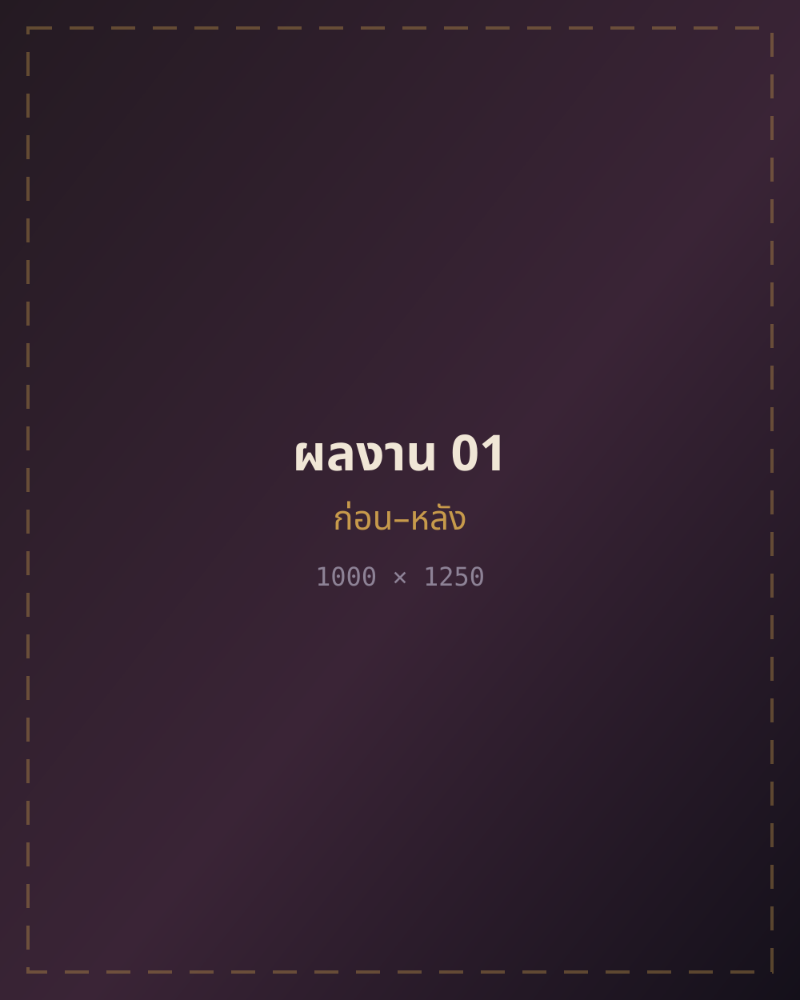
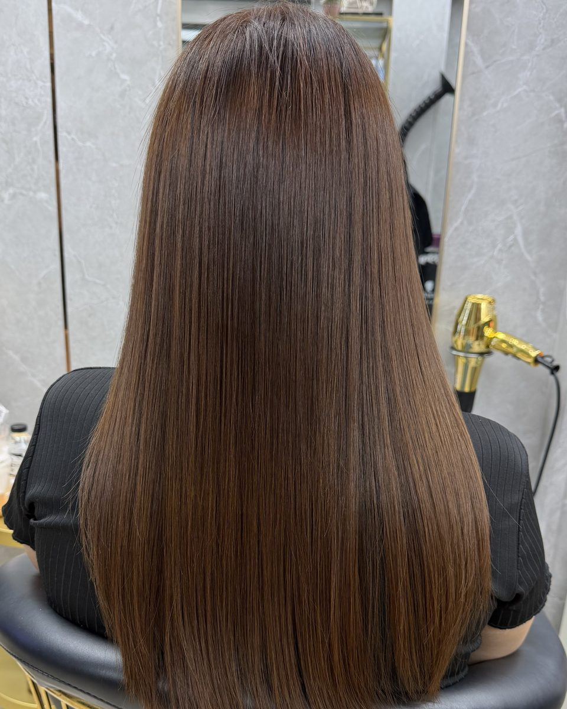

# 511 SALON — หน้า Landing (เฟส 1)

หน้าเดียวจบ แนะนำร้านและโชว์ผลงาน ตามแบบใน [`design/511-salon-blueprint.html`](../design/511-salon-blueprint.html)
เขียนด้วย HTML + CSS + JavaScript ล้วน ไม่มี build step ไม่มี dependency

**ยังไม่ได้ทำในเฟสนี้:** หน้าบริการรายตัว 6 หน้า · หน้าราคา · หน้าสาขาแยก · FAQ · บล็อก · เวอร์ชันภาษาอังกฤษ
(อยู่ในเฟส 2–4 ของ blueprint)

---

## ดูหน้าเว็บ

```bash
cd 511salon
python3 -m http.server 8765
# เปิด http://localhost:8765/
```

ห้ามเปิดไฟล์ `index.html` ตรง ๆ ด้วย `file://` — ฟอนต์และ ES module จะโดน CORS บล็อก

---

## โครงไฟล์

```
511salon/
├── index.html                    หน้าเดียวทั้งหมด (รวม JSON-LD)
├── assets/
│   ├── css/main.css              ทุกสไตล์ · แก้สี/ฟอนต์ที่ :root ชั้นบนสุด
│   ├── js/main.js                ES module ตัวเดียว 8 ฟังก์ชัน
│   ├── fonts/*.woff2             Anuphan + IBM Plex Sans Thai + IBM Plex Mono
│   │                             (subset ไทย+ละติน · สัญญาอนุญาต SIL OFL 1.1)
│   └── img/
│       ├── favicon.svg
│       └── placeholder/*.svg     ภาพชั่วคราว ลบทิ้งเมื่อได้ภาพจริง
└── tools/make-placeholders.py    สคริปต์สร้างภาพชั่วคราวใหม่
```

**ขนาดที่โหลดจริง:** HTML 8.9 KB · CSS 5.7 KB · JS 2.8 KB (หลัง gzip) + ฟอนต์ 140 KB
งบตาม blueprint คือ CSS < 25 KB, JS < 30 KB — ยังเหลือที่เยอะ

---

## เปลี่ยนภาพชั่วคราวเป็นภาพจริง

ทุกช่องภาพในหน้าตอนนี้ชี้ไปที่ `assets/img/placeholder/<ชื่อ>.svg`
ในภาพชั่วคราวเขียนบอกไว้แล้วว่าช่องนั้นต้องใช้ภาพอะไรและขนาดเท่าไร

**ขั้นตอน**

1. ส่งออกภาพจริงเป็น AVIF + WebP + JPG อย่างละ 3 ความกว้าง (480 / 960 / 1600)
   ตั้งชื่อไฟล์ให้บอกเรื่อง เช่น `keratin-before-after-01-960.avif`
   ไม่ใช่ `IMG_2934.jpg`
2. วางไว้ใน `assets/img/` (แยกโฟลเดอร์ย่อยได้ตามใจ)
3. ใน `index.html` เปลี่ยนจาก

   ```html
   
   ```

   เป็น

   ```html
   <picture>
     <source type="image/avif" sizes="(max-width:860px) 100vw, 25vw"
             srcset="assets/img/work-01-480.avif 480w,
                     assets/img/work-01-960.avif 960w,
                     assets/img/work-01-1600.avif 1600w">
     <source type="image/webp" sizes="(max-width:860px) 100vw, 25vw"
             srcset="assets/img/work-01-480.webp 480w,
                     assets/img/work-01-960.webp 960w,
                     assets/img/work-01-1600.webp 1600w">
     
   </picture>
   ```

4. เก็บค่า `width`/`height` ไว้เสมอ (กัน CLS) และเก็บ `alt` ภาษาไทยเดิมไว้ —
   ข้อความ alt เขียนบรรยายภาพจริงแล้ว ใช้ได้ทั้งกับโปรแกรมอ่านหน้าจอและ Google Images
5. ภาพ hero ต่างจากภาพอื่น: ต้องคง `fetchpriority="high"` ไว้ **และห้ามใส่ `loading="lazy"`**
   พร้อมแก้ `<link rel="preload" as="image">` ใน `<head>` ให้ชี้ไฟล์ใหม่ — นี่คือ LCP ของหน้า
6. เปลี่ยนภาพในสไลเดอร์เทียบ ก่อน–หลัง ต้องแก้ทั้งใน `` และใน `data-before` /
   `data-after` ของปุ่มแท็บ `[data-case]` ด้วย ไม่งั้นพอสลับเคสจะกลับไปเป็นภาพชั่วคราว
7. ลบโฟลเดอร์ `assets/img/placeholder/` เมื่อไม่มีที่ไหนอ้างถึงแล้ว

**ภาพผลงานต้องได้รับความยินยอมจากลูกค้าในภาพก่อนนำขึ้นเว็บเสมอ** — เชิงอรรถข้อ 3
ท้ายหน้าประกาศเรื่องนี้ไว้แล้ว ถ้ายังไม่ได้เก็บความยินยอมต้องแก้ข้อความนั้นด้วย

---

## รายการที่ต้องทำก่อนขึ้นโดเมนจริง

- [ ] **ลบ `<meta name="robots" content="noindex,nofollow">`** ใน `<head>`
      ตอนนี้กันไม่ให้ Google เก็บหน้าพรีวิวบน github.io ไปแข่งกับ 511salon.com
- [ ] เติมทุกจุดที่เขียนว่า `TODO(ยืนยัน)` ใน `index.html` — ค้นด้วย `grep -n "TODO" index.html`
      - ที่อยู่เต็ม + รหัสไปรษณีย์ ทั้งสองสาขา (อยู่ทั้งใน JSON-LD, ส่วนสาขา และฟุตเตอร์)
      - พิกัด `geo` ของแต่ละสาขา
      - ลิงก์ LINE OA ตัวจริง (`https://lin.ee/...`) — ตอนนี้ใช้ `line.me/R/ti/p/@511salon` เป็นค่าชั่วคราว
      - ลิงก์ Google Maps ของแต่ละสาขา
      - เวลาปิดร้านจริง (ตอนนี้ใส่ 20:00 ไว้ ทั้งในหน้าและใน `openingHoursSpecification`)
      - เบอร์ไหนเป็นของสาขาไหน
      - เรื่องราวของร้านในหัวข้อ “เกี่ยวกับร้าน” (ตอนนี้เป็นข้อความตั้งต้น)
- [ ] ตรวจราคาทั้ง 8 รายการว่าตรงกับราคาปัจจุบัน (อยู่ทั้งในการ์ดบริการและใน `makesOffer`)
- [ ] ใส่โค้ด GA4 ท้าย `<head>` — ปุ่มทุกปุ่มมี `data-ev` พร้อมยิงอีเวนต์อยู่แล้ว
      (`click_line`, `click_phone`, `click_map`, `click_social`, `drag_compare`)
- [ ] วางไฟล์ `CNAME`, `robots.txt`, `sitemap.xml`, `404.html` ที่รากโดเมน
- [ ] ตั้ง DNS + เปิด Enforce HTTPS ใน GitHub Pages
- [ ] ยืนยันโดเมนใน Search Console แล้วส่ง sitemap
- [ ] เปลี่ยนลิงก์เว็บใน Google Business Profile ทั้งสองสาขา + TikTok bio + Facebook

---

## หมายเหตุการตัดสินใจ

**ทำไมโฮสต์ฟอนต์เอง** — ฟอนต์ไทยไฟล์ใหญ่และการต่อไปโดเมนที่สาม (fonts.gstatic.com)
ทำให้ LCP ช้าลง 200–400 ms ไฟล์ที่วางไว้เป็น subset เฉพาะช่วงอักขระไทยกับละติน
เบราว์เซอร์จะโหลดเฉพาะ subset ที่หน้านั้นใช้จริงตาม `unicode-range`

**ทำไม `line-height` พาดหัวเป็น 1.25 ไม่ใช่ 1.14** — ภาษาไทยวางสระบนซ้อนวรรณยุกต์ได้ถึงสองชั้น
ค่าที่ต่ำกว่า 1.22 ที่ขนาดพาดหัวทำให้บรรทัดชนกัน (เจอตอนทดสอบจริง ไม่ใช่ทฤษฎี)

**ทำไมยังไม่มี AggregateRating ใน JSON-LD** — Google ไม่นับรีวิวที่เจ้าของเว็บใส่เอง
และเสี่ยงโดน manual action ให้เก็บรีวิวไว้ที่ Google Business Profile แทน
(เหตุผลเต็มอยู่ใน blueprint §7.4)

**ทำไมทุก path เป็น relative** — หน้านี้จึงย้ายจาก `chanoninnet.github.io/511salon/`
ไปเป็นรากของ `511salon.com` ได้โดยไม่ต้องแก้ path สักบรรทัด
